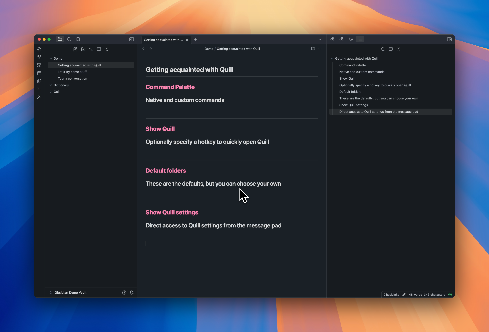
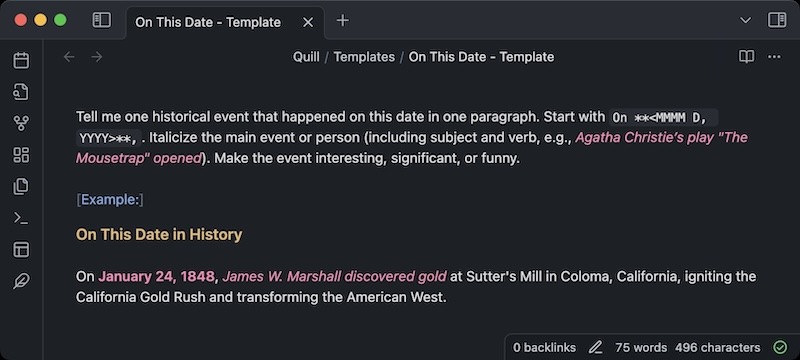
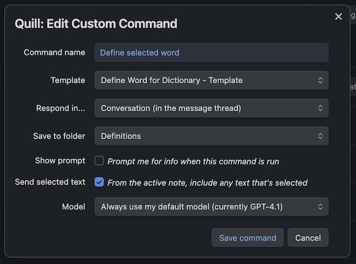
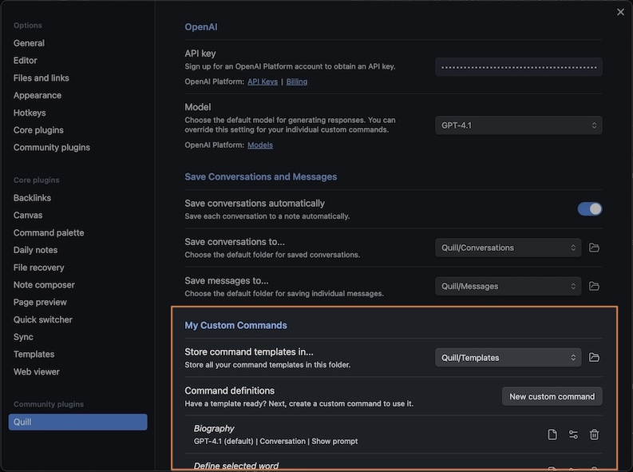

# Obsidian Quill

Quill is an AI assistant and custom command creator for
[Obsidian](https://obsidian.md/). Quickly interact with your notes directly,
and create custom commands that you can use ad hoc or again and again.

## _Demo on YouTube_

## _The basics... and trying out Quill_

### _Setup_

- [Obtain an OpenAI API key](https://platform.openai.com/api-keys)
- [Buy API
  credits](https://platform.openai.com/settings/organization/billing/overview)
  ($5 can last you a long while)
- Enter your API key in **Settings → Quill**

### _Converse with an AI assisant_

What you would expect in an AI chat, plus...

- **Navigate** through messages using the keyboard:
  - `j` next, `k` previous
  - `f` first, `l` last
  - `b` bottom
- **Interrupt** a response using `esc`
- **Minimize** and expand lengthy messages
- **Save** a message to a new note
- **Save** a conversation to a note

## _Custom Commands_

A custom command is simply the combination of...

### **Template note**

Just a note that contains your instructions for what you expect from the
command. Be as general or as specific as you like.

For example, a template could contain...

- A document template _("fill this out")_
- An example of output _("like this")_
- Specific formatting guidance _("Use oxford commas!")_
- Frontmatter guidance _("Tag this note according to the content")_
- ... and anything else that will help get the response you are looking for.

##### _Example_

### **Command definition**

- Name the command
- Choose the template note
- Choose where to send the response: conversation or active note
- Set any optional preferences

##### _Example_

Run the command using its name in the Command Palette, or optionally, assign a
keyboard shortcut to make it even faster.

## _Create a Custom Command_

Make sure you've chosen your templates folder (see below)

1. Create a template note in that folder.
2. Click _New custom command_. Just give your command a name, choose the
   template, and choose your other preferences.

#### **Settings → Quill → My Custom Commands**

